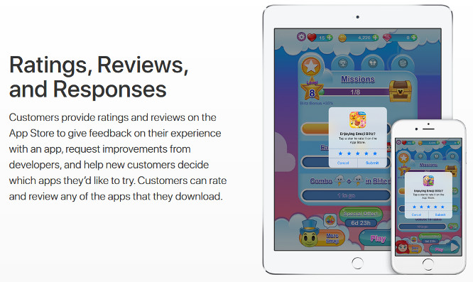
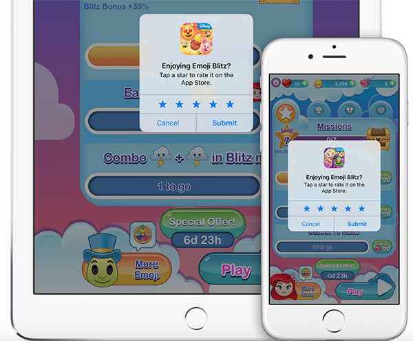

# com.omarben.inappreview
Cordova Plugin that use the iOS class SKStore​Review​Controller to open the inapp review popup available since iOS 10.3

<p align="center">

</p>

<p align="center">

</p>

SKStore​Review​Controller: https://developer.apple.com/reference/storekit/skstorereviewcontroller?language=objc 
Controls the process of requesting App Store ratings and reviews from users.

Overview
Use the request​Review method to indicate when it makes sense to ask the user for ratings and review within your app.

+ request​Review
Tells StoreKit to ask the user to rate or review your app, if appropriate.


## Installation (iOS +10.3 only)
```
cordova plugins add https://github.com/omaxlive/com.omarben.inappreview
```


## How-to use example in your cordova project:
```
inappreview.requestReview(success, failure);
```

More detailed example:
```
var requestReview = function(){
  try{
    var success = function() {
        console.log("success");
    }
    var failure = function() {
        console.log("Error calling Galaxy plugin");
    }
    inappreview.requestReview(success, failure);
  }catch(e){
    console.log("catch: "+e);
  }
};
```

## More information about the use of in app review
Apple is also limiting the amount of times developers can ask customers for reviews. Developers will only be able to bring up the review dialog three times a year. If a customer has rated the app, they will not be prompted again. If a customer has dismissed the review prompt three times, they will not be asked to review the app for another year.
More: http://www.loopinsight.com/2017/01/24/apple-explains-the-new-app-reviews-api-for-developers/ 


## Credits

inappreview plugin was created by Omar Ben brahim.

## License

inappreview is available under the MIT license. See the LICENSE file for more info.

